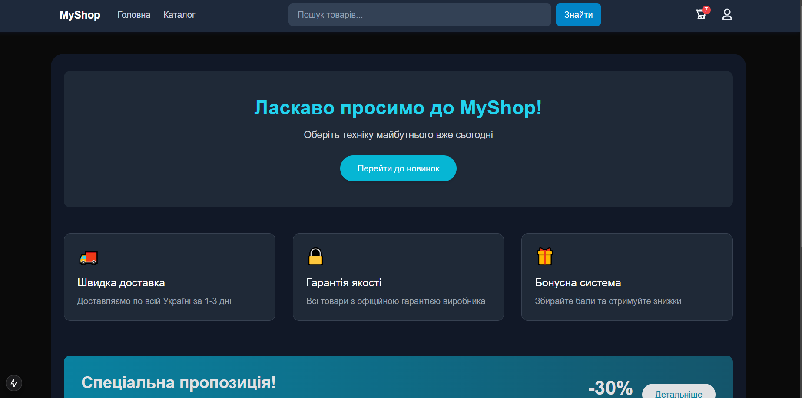
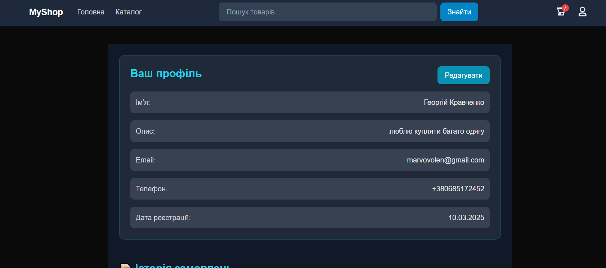

#  MyShop
> Платформа для покупок різних речей.



## 📌 Про проєкт

`MyShop` — це вебсервіс, який імітує роботу онлайн магазину, у ньому є авторизація, профіль, та імітація покупки.


## 🧠 Зміст

- [Про проєкт](#про-проєкт)
- [Технології](#технології)
- [Функціонал](#функціонал)
- [Скріншоти](#скріншоти)
- [Встановлення](#встановлення)
- [Roadmap](#roadmap)
- [Контакти](#контакти)
- [Ліцензія](#ліцензія)

---


##🛠 Використані технології:
Проєкт створено за допомогою:

- React + Next.js
- Redux Toolkit
- Tailwind CSS
- TypeScript
- Firebase

## ✅ Функціонал

- 🔐 Реєстрація / Авторизація
- 🔍 Пошук та фільтри
- 💾 Збереження даних в БД Firestore
- 🛒 Збереження у "Кошик"
- 🌓 Світла / Темна тема
- 📱 Адаптивна верстка

---

## 📸 Скріншоти

| Головна сторінка | Сторінка профілю |
|------------------|------------------|
|  | ! |
---

---

## ⚙️ Встановлення

1. Клонуй репозиторій:
```bash
git clone https://github.com/yourusername/project-name.git
cd project-name
```
2. Встанови залежності:
```bash
npm install
```
3. Запусти проєкт локально:
```bash
npm run dev
```
4. Відкрий у браузері:
http://localhost:3000

## 🧑‍💻 Контакти

Мене звати Георгій Кравченко. Якщо э ідеї як покращити проект — пиши!

-Email: georgykravchenko2025@gmail.com
-Telegram: @Jorak2006
-LinkedIn: [Посилання](https://www.linkedin.com/in/%D0%B3%D0%B5%D0%BE%D1%80%D0%B3%D1%96%D0%B9-%D0%BA%D1%80%D0%B0%D0%B2%D1%87%D0%B5%D0%BD%D0%BA%D0%BE-108591367/)